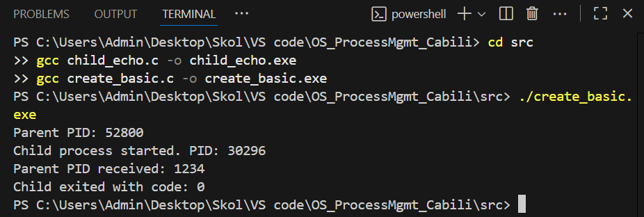
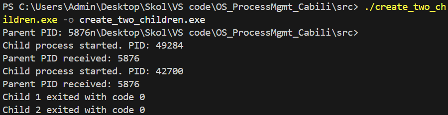
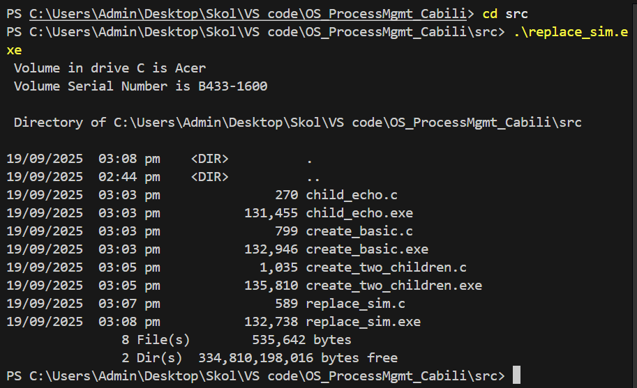
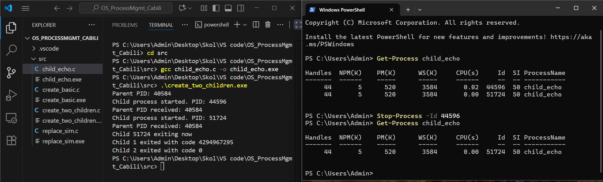

# Lab 1 – Process Management (Windows)

**Student:** Calvin Oliver Cabili  
**Environment:** Windows 11, VS Code, MinGW-w64 (GCC)

---

## Build Instructions
The programs were written and compiled in Visual Studio Code using MinGW-w64 as the compiler.  
To build the executables, I navigated to the `src` folder and used the following commands:

```bash
gcc child_echo.c -o child_echo.exe
gcc create_basic.c -o create_basic.exe
gcc create_two_children.c -o create_two_children.exe
gcc replace_sim.c -o replace_sim.exe


---
## Task A – Single Child
In this task, the parent process displayed its own PID and launched `child_echo.exe`. 
The child process printed its PID along with the parent PID it received as an argument.  
Afterward, the parent waited for the child to finish and then displayed the child’s exit code.  

**Screenshot:**  


---

## Task B – Two Children
For this task, the parent created two child processes in parallel.  
Both children printed their PIDs, and the parent waited for each of them to complete.  
Finally, the parent displayed the exit codes of the two child processes.  

**Screenshot:**  


---

## Task C – Simulated exec()
Here, the parent process executed the command `cmd /c dir`.  
It waited for the spawned process to finish and then exited with the same exit code.  
This simulated the behavior of the `exec()` function in Linux.  

**Screenshot:**  


---

## Task D – Managing in PowerShell
In this task, I used PowerShell to check the running child processes with the command:  
```powershell
Get-Process child_echo
I then terminated one process using Stop-Process -Id <PID>.

**Screenshot:**  
